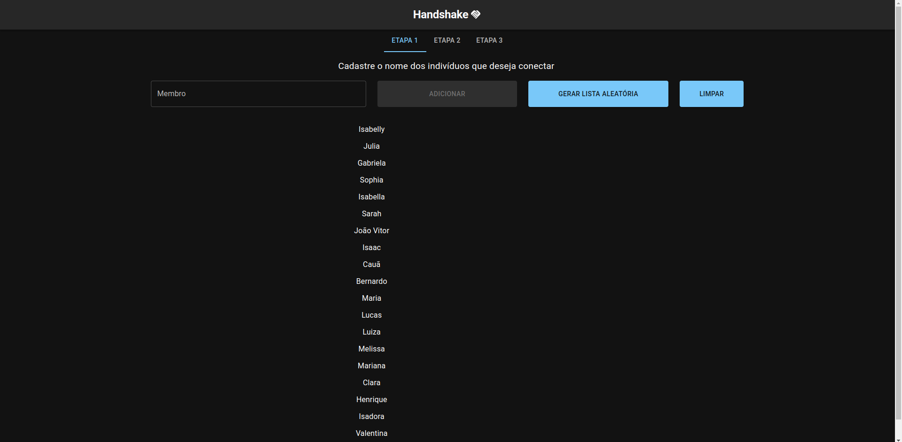
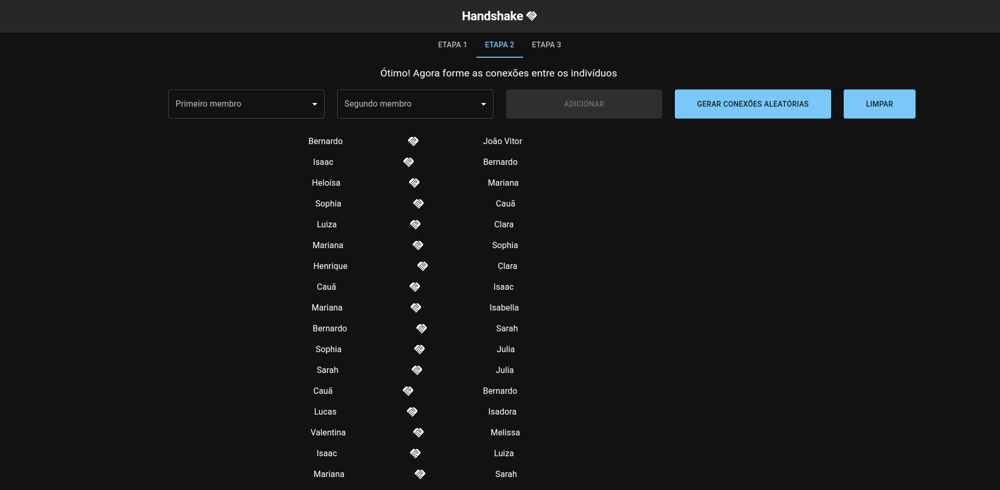
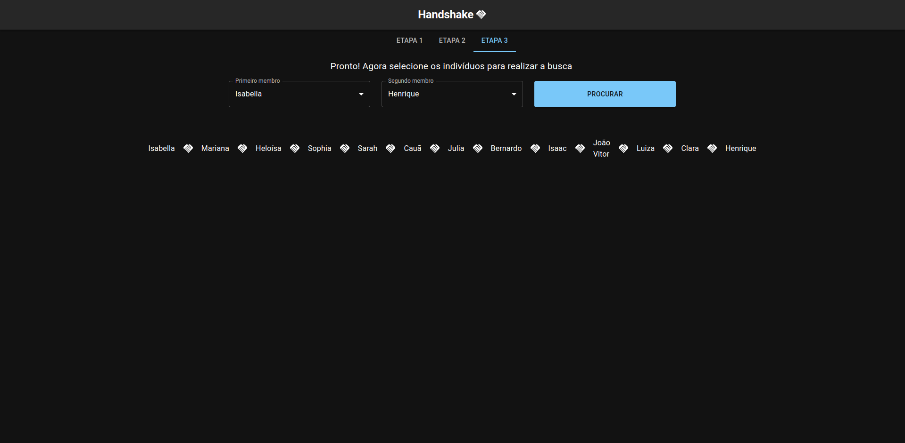

# Handshake

**Número da Lista**: Não se aplica 
**Conteúdo da Disciplina**: Grafos 1 

## Alunos
|Matrícula | Aluno |
| -- | -- |
| 18/0041592  |  Denys Rógeres |
| 19/0109963  |  João Victor Batista |

## Sobre 
Ao longo de suas vidas, é comum que pessoas cumprimentem umas as outras e uma das formas mais comuns é através de um aperto de mão ou *handshake*. Consideremos então 3 indivíduos:

- João
- Miguel
- Pedro

Se João apertou mão de Miguel e Miguel apertou a mão de Pedro, podemos considerar que agora existe uma conexão indireta entre João e Pedro.

O objetivo do projeto consiste verficar se existe alguma conexão, direta ou indireta, entre 2 indivíduos selecionados e encontrar o caminho dessas conexões.

## Screenshots

*Etapa 1: Cadastro de indivíduos*

 

*Etapa 2: Conectar indivíduos*

 

*Etapa 3: Busca entre indivíduos*

 

## Instalação 
**Linguagem**: Javascript 
**Framework**: React 
<!-- Descreva os pré-requisitos para rodar o seu projeto e os comandos necessários. -->

## Uso 
Explique como usar seu projeto caso haja algum passo a passo após o comando de execução.

## Outros 
Quaisquer outras informações sobre seu projeto podem ser descritas abaixo.

