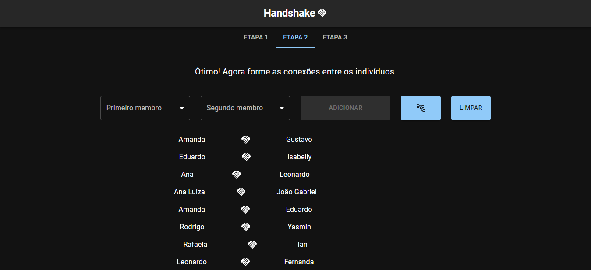

# Handshake

**Número da Lista**: 18<br>
**Conteúdo da Disciplina**: Grafos 1<br>

## Alunos
|Matrícula | Aluno |
| -- | -- |
| 18/0041592  |  Denys Rógeres |
| 19/0109963  |  João Victor Batista |

## Video de Apresentação
Pode ser encontrado pelo
[Link Drive](https://drive.google.com/file/d/1fANQVUZmKnfT5CXJG190nENJ3vjK8Whd/view?usp=sharing)
ou na pasta assets do projeto.

## Deploy
[handshake-gold.vercel.app](https://handshake-gold.vercel.app/)


## Sobre 
Ao longo de suas vidas, é comum que pessoas cumprimentem umas as outras e uma das formas mais comuns é através de um aperto de mão ou *handshake*. Consideremos então 3 indivíduos:

- João
- Miguel
- Pedro

Se João apertou mão de Miguel e Miguel apertou a mão de Pedro, podemos considerar que agora existe uma conexão indireta entre João e Pedro.

O objetivo do projeto consiste verficar se existe alguma conexão, direta ou indireta, entre 2 indivíduos selecionados e encontrar o caminho dessas conexões.

## Screenshots


*Etapa 1: Cadastro de indivíduos*

<br/>



*Etapa 2: Conectar indivíduos*

<br/>


*Etapa 3: Busca entre indivíduos*

<br/>

## Instalação 
**Linguagem**: Javascript<br>
**Framework**: React<br>

<!-- Descreva os pré-requisitos para rodar o seu projeto e os comandos necessários. -->
### Requisitos 
- *npm* ou *yarn*
- node v16

<br/>

Para inicializar o projeto digite o comando:
```
$ npm run dev
```

ou 

```
$ yarn dev
```

## Uso 
O sistema é composto de 3 etapas:
- Na primeira o usuário deve adicionar manualmente os indivíduos ou gerar um lista aleatória;
- Na segunda etapa, ele(a) deve formar as conexões entre os indivíduos registrados;
- Na terceira e última etapa o usuário escolhe 2 indivíduos e o algoritmo irá verificar se existe conexão entre eles e, caso exista, exibir o caminho dessas conexões

<!-- ## Outros 
Quaisquer outras informações sobre seu projeto podem ser descritas abaixo. -->


